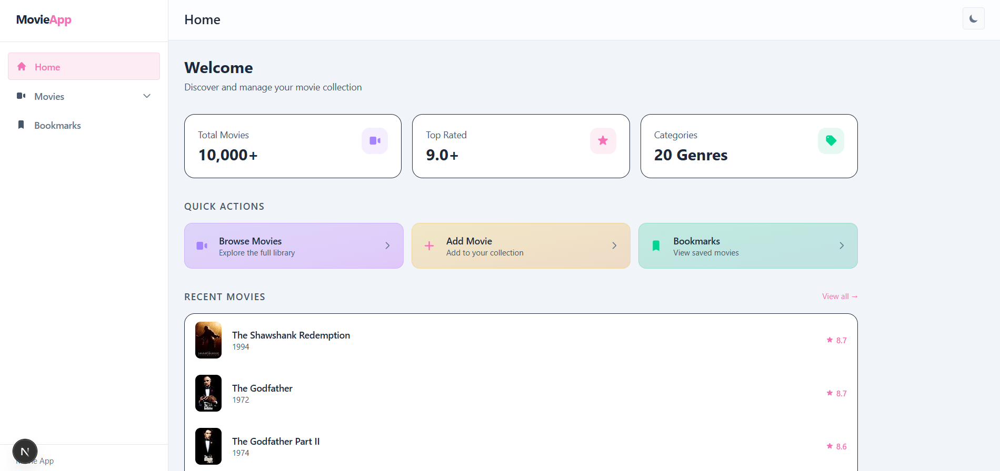
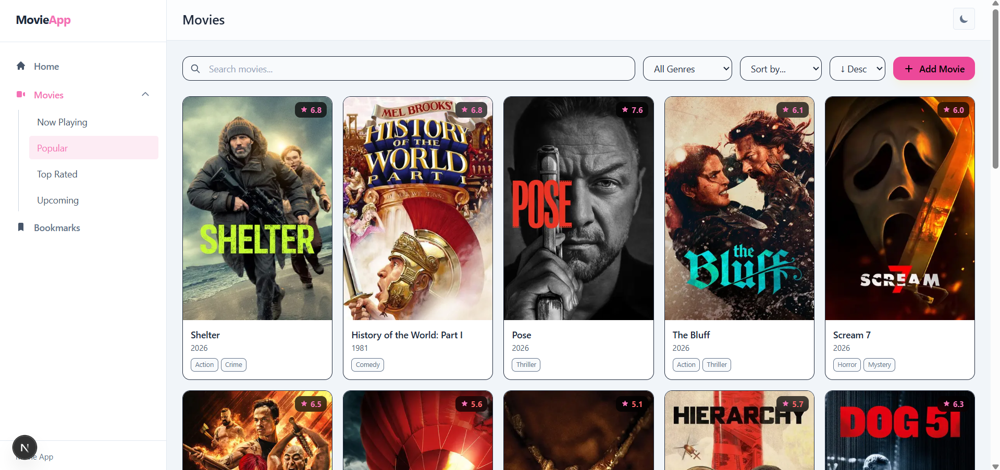
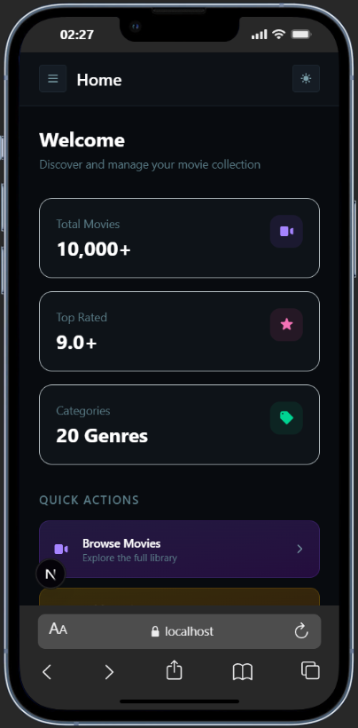
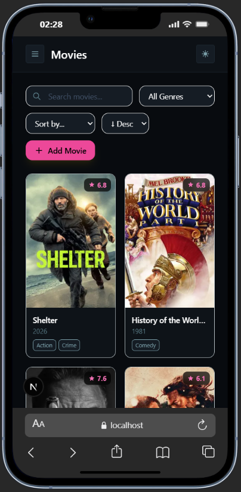

# Movie App


A movie discovery and management web app powered by the TMDB API.

## Screenshots

<div align="center">
  
  
  
  
</div>

## Features

- **Browse movies** — now playing, popular, top rated, upcoming categories
- **Search & filter** — search by title, filter by genre, sort by popularity / rating / release date
- **Movie detail** — poster, rating, genres, overview
- **Add / Edit movie** — form validation with Formik + Yup
- **Delete movie** — remove from list
- **Bookmarks** — save movies to a personal bookmark list
- **Pagination** — server-side pagination via TMDB
- **Dark / Light mode** — theme toggle powered by next-themes
- **Responsive** — collapsible sidebar on mobile

## Project Structure

```
src/
├── action/          # Call service & store update
│   └── movieAction.js
├── app/             # Next.js app router pages & API route
├── components/      # Layout & reusable components
│   ├── layout/      # Navbar, Sidebar, AppShell
│   └── movies/      # MovieCard, MovieList, MovieForm, Pagination
│   ...
├── const/           # Nav items config
├── service/         # Communicate directly with internal API
├── store/           # Zustand store
└── utils/
    └── api.js       # Axios instance
```

## Run the project

**Clone and install**

```bash
git clone https://github.com/ratukf/movie-app
cd movie-app
npm install
```

**Set up environment**

```bash
cp .env.example .env.local
```

Fill in your TMDB API key in `.env.local`:

```
API_URL=https://api.themoviedb.org/3
API_KEY=your_tmdb_api_key
```

**Run in development**

```bash
npm run dev
```

**Build for production**

```bash
npm run build
```

## License

MIT
